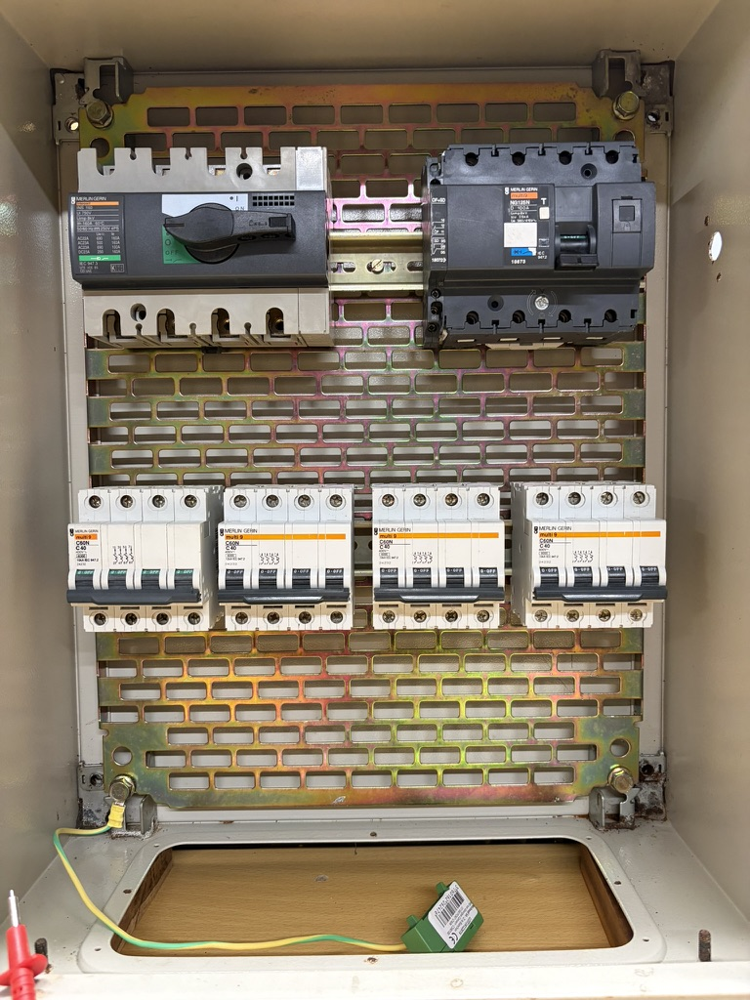

# Current Power Cabinet

## Overview

This document describes the current main power cabinet being developed within HospitalityLab.

The cabinet is intended as a learning and experimentation platform for studying electrical distribution concepts commonly found in hospitality and commercial environments.

At the time of writing, the cabinet is still under construction and no final wiring has been completed.

## Electrical Context

HospitalityLab is based in France.

Unless otherwise specified, electrical documentation follows European and French standards and practices.

The cabinet is designed around a three-phase, four-wire (3P+N) 230/400 V electrical system, commonly used in commercial and industrial installations throughout Europe.

## Current Equipment

Most of the equipment has been acquired second-hand and repurposed for experimentation.

The cabinet currently includes:

- Main disconnect switch
- Main molded-case circuit breaker
- Multiple three-phase outgoing circuit breakers
- Industrial metal enclosure
- DIN rail mounting system

## Purpose

The objective is not to reproduce the electrical capacity of a real hotel, camping or restaurant.

Instead, the goal is to understand and document electrical distribution principles, protection systems and infrastructure design on a smaller and more manageable scale.

The cabinet serves as a platform for experimentation, learning and documentation.

## Current Status

🚧 Under Construction

The cabinet is currently being assembled.

Hardware installation has started, but the final wiring and distribution design are still being developed.

## Disclaimer

⚠️ Safety First

HospitalityLab is a personal laboratory project.

The installations, experiments and prototypes documented here are intended for learning, testing and exploration purposes.

Many systems are works in progress, experimental setups or temporary installations.

The information provided should not be considered professional electrical advice, engineering guidance or proof of regulatory compliance.

Electricity can be dangerous.

Always follow applicable regulations, use appropriate protective equipment and ensure that work is carried out by competent individuals.

## Current Installation

Main power distribution cabinet currently under development within HospitalityLab. The installation is based on a three-phase 230/400 V distribution system and consists primarily of second-hand equipment acquired for experimentation and learning purposes.
